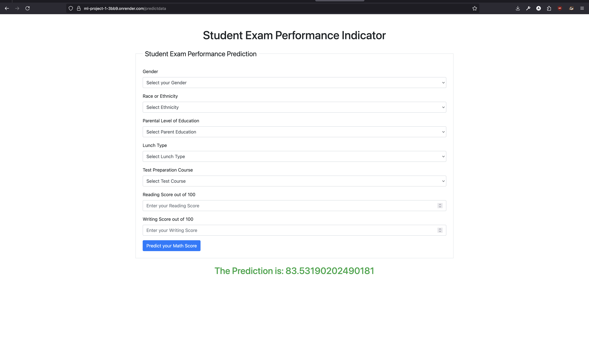

# 🧠 Student Performance Prediction 🎓

A full-stack machine learning web application that predicts a student's **math score** based on demographics and academic performance. Built with a modular ML pipeline, Flask, and deployed using Docker + Render.

---

## 🚀 Features

- Predicts student math scores using advanced regression models
- Trains and compares 10+ ML regressors (incl. ensemble models)
- Performs automatic hyperparameter tuning using GridSearchCV
- Selects and persists the best-performing model
- Implements modular pipeline: data ingestion, transformation, training
- Uses custom exception and logging classes for full traceability
- Clean Flask interface for real-time predictions
- Fully containerized using Docker
- Deployed live on Render
- Available as a Docker image on Docker Hub

---

## 🧪 Demo

🌐 **Live App**: [https://ml-project-1-3bb9.onrender.com]

🖼️ Screenshot:



---

## 🛠️ Tech Stack

- **Python 3.10**
- **Flask**
- **Scikit-learn**, **CatBoost**, **XGBoost**
- **Pandas**, **NumPy**, **Matplotlib**, **Seaborn**
- **Gunicorn** for production server
- **Docker** for containerization
- **Render** for cloud deployment

---

## 📦 Project Structure

.
├── app.py # Main Flask application
├── templates/ # HTML templates for UI
│ |── home.html
| └── index.html
├── artifacts/ # Stored models, preprocessors, logs
│ ├── model.pkl
│ ├── preprocessor.pkl
│ └── logs/
├── src/ # Source code for ML pipeline
│ ├── init.py
│ ├── data_ingestion.py
│ ├── data_transformation.py
│ ├── model_trainer.py
│ ├── logger.py
│ └── exception.py
├── requirements.txt # Python dependencies
├── Dockerfile # Docker container configuration
├── README.md # Project documentation

---

## 🔍 ML Model Pipeline

During training, the app:
1. Ingests and preprocesses student performance data
2. Applies transformations (e.g., label encoding, scaling)
3. Trains and evaluates the following regressors:
   - `LinearRegression`
   - `Lasso`
   - `Ridge`
   - `K-Neighbors Regressor`
   - `Decision Tree Regressor`
   - `Random Forest Regressor`
   - `XGBoost Regressor`
   - `CatBoost Regressor`
   - `AdaBoost Regressor`
   - `Gradient Boosting Regressor`
4. Performs **hyperparameter tuning** with `RandomizedSearchCV`
5. Selects the best model based on R² score
6. Saves the model and preprocessor as `.pkl` files for prediction

🛡️ All steps are logged using a custom `logger.py`  
🚨 Errors are handled via a custom `CustomException` class.

---

## 🐳 Docker Hub

The app is publicly available as a Docker image:

🔗 **Docker Image**: [ashritw2000/student_performance_prediction](https://hub.docker.com/r/ashritw2000/student_performance_prediction)

### ▶️ Pull and Run:

```bash
docker pull ashritw2000/student_performance_prediction
docker run -p 5000:5000 ashritw2000/student_performance_prediction
